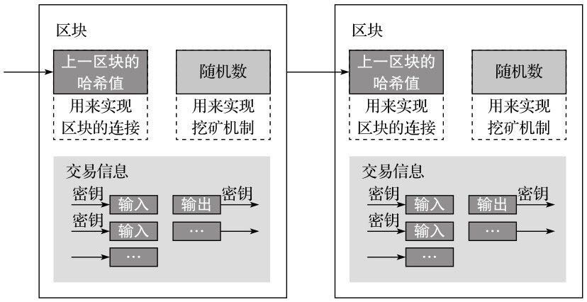
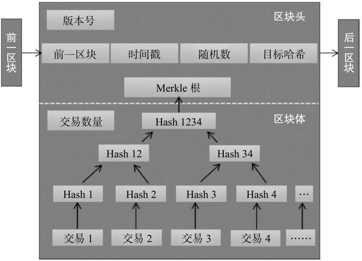

### 区块链本质
区块链(blockchain)本质上是一个对等网络(peer-topeer)的分布式账本数据库。 区块链本身其实是一串链接的数据区块，其链接指针是采用密码学哈希算法对区块头进行处理所产生的区块头哈希值。

> 区块链分类：
1.以参与方式分类：公开链(Public BlockChain)、联盟链(Consortium BlockChain)和私有链(Private BlockChain)。
2.以链与链的关系分类：主链和侧链。

区块链系统包含技术：

### 区块

区块链由一个个区块（block）组成。 每个区块一般包含区块头(Header)和区块体(Body)两部分。

### 挖矿
所谓挖矿，实际上是穷举随机数算法，把上个区块的哈希值加上10分钟内的全部交易单打包，再加上一个随机数，算出一个256位的字符串哈希值，输入的随机数Nonce使哈希值满足一定条件就获得这个区块的交易记账权。
> 因此，挖矿实际是计算哈希值的过程，矿工则指计算哈希值的服务器。

### 分布式

### 共识算法

要求在没有中心节点的情况下保证各个诚实节点记账的一致性。
区块链共识机制目前主要有4类：
1.POW
工作量证明机制
2.POS
3.DPOS
4.分布式一致性算法

### 哈希函数

### 加密算法
* 非对称加密算法

### 比特币
获取比特币有3中途径： 一是作为矿工挖矿获得，二是线上交易所购买或者线下通过中间人购买，三是作为商家收取比特币

### 以太坊
