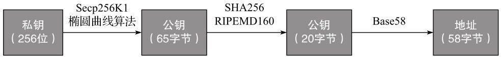

### 区块链本质
区块链(blockchain)本质上是一个对等网络(peer-topeer)的分布式账本数据库。 区块链本身其实是一串链接的数据区块，其链接指针是采用密码学哈希算法对区块头进行处理所产生的区块头哈希值。

> 区块链分类：
1.以参与方式分类：公开链(Public BlockChain)、联盟链(Consortium BlockChain)和私有链(Private BlockChain)。
2.以链与链的关系分类：主链和侧链。

区块链系统包含技术：

### 区块

区块链由一个个区块（block）组成。 每个区块一般包含区块头(Header)和区块体(Body)两部分。

### 挖矿
所谓挖矿，实际上是穷举随机数算法，把上个区块的哈希值加上10分钟内的全部交易单打包，再加上一个随机数，算出一个256位的字符串哈希值，输入的随机数Nonce使哈希值满足一定条件就获得这个区块的交易记账权。
> 因此，挖矿实际是计算哈希值的过程，矿工则指计算哈希值的服务器。

### 分布式

### 共识算法

要求在没有中心节点的情况下保证各个诚实节点记账的一致性。
区块链共识机制目前主要有4类：
1.POW
工作量证明机制
2.POS
3.DPOS
4.分布式一致性算法

### 哈希函数

* 哈希函数性质

>1．抗碰撞性
碰撞是指两个不同的消息在同一个哈希函数作用下，具有相同的哈希值。对于哈希值长度为256位的哈希函数，要找到碰撞对，平均需要完成2128次哈希计算，如果计算机每秒能够进行10000次哈希计算，则需要约1027年才能完成这2128次哈希计算。
2.原像不可逆性
原像不可逆是指知道输入值，很容易通过哈希函数计算出哈希值；但知道哈希值，没有办法计算出原来的输入值。

### 加密算法
* 非对称加密算法

> 非对称加密算法指的就是存在一对数学相关的密钥，使用其中一个密钥进行加密的数据信息，只有使用另一个密钥才能对该信息进行解密。这对密钥中，对外公开的密钥叫作公钥，不公开的密钥就叫作私钥。打个比方来说，公钥就像银行的账户，私钥就像是该账户的密码或者账户所有者的签名。区块链之上的有效交易有一个用于交易发起方私钥签名有效的数字签名，而该交易的签名可以通过使用交易发起方的公钥进行验证。公钥可以通过算法从私钥中计算得出，但私钥却不能从公钥中推出。比特币系统中使用的就是一种非常典型的非对称加密算法——椭圆曲线加密算法（ECC）。

* 数字签名

>数字签名就是在信息后面加上另一段内容，作为发送者的证明并且证明信息没有被篡改。一般是发送者将信息用哈希算法处理得出一个哈希值，然后用私钥对该哈希值进行加密，得出一个签名。然后发送者再将信息和签名一起发送给接收者。接收者使用发送者的公钥对签名进行解密，还原出哈希值，再通过哈希算法来验证信息的哈希值和解密签名还原出来的哈希值是否一致，从而可以鉴定信息是否来自发送者或验证信息是否被篡改。

### 比特币

 * 比特币获取

>获取比特币有3中途径： 一是作为矿工挖矿获得，二是线上交易所购买或者线下通过中间人购买，三是作为商家收取比特币

* 哈希算法

> 比特币系统中最常采用的哈希函数是双SHA256哈希函数，通俗来说就是将不同长度的原始数据用两次SHA256哈希函数进行处理，再输出长度为256的二进制数字来进行统一的识别和存储。

 > 

* 加密算法

>  比特币系统一般从操作系统底层的一个密码学安全的随机源中取出一个256位随机数作为私钥，私钥总数为2256个，所以很难通过遍历所有可能的私钥得出与公钥的对应的私钥。用户使用的私钥还会通过SHA256和Base58转换成易书写和识别的50位长度的私钥，公钥则首先由私钥和Secp256k1椭圆曲线算法生成65字节长度的随机数。一般情况下，比特币钱包的地址也由公钥所生成，其生成过程为首先将公钥进行SHA256和RIPEMD160双哈希运算，并生成20字节长度的摘要结果（即Hash160结果），这个将作为比特币地址的主体（body）信息，再在前面加上版本前缀0x00，在后面添加4个字节的地址校验码。地址校验码通过对摘要结果进行两次SHA256运算，取哈希值的前4位产生。最后通过Base58处理把连在一起的版本前缀、主体信息和校验码转换成可以容易让人识别的比特币字符地址。

* 工作量证明
>  要求得到的哈希结果（以十六进制的形式表示）以若干个0开头的。按照这个规则，由x=1出发，递增x的值，我们需要经过2688次哈希计算才能找到前3位均为0的哈希值，而要找到前6位均为0的哈希值，则需进行620969次哈希计算。也就是说，没有更快捷的方法来产生一个满足要求的哈希结果。这样通过哈希运算得出的符合特定要求的哈希值，可以作为共识算法中的工作量证明。

### 以太坊
